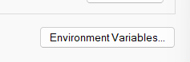

# x86_64-pc-windows-gnu

Once you have installed rustup following the steps in the Toolchain Setup chapter, we will install GCC for MINGW64 and then we can start using rust to compile our projects.

## Installing GCC:

- Open MINGW64 terminal of MSYS2, by typing in `MSYS2 MINGW64` in the search bar and opening the terminal. 

- Type in the following command to install GCC: `pacman -S mingw-w64-x86_64-gcc` and click enter.

- It might confirm installation with you, type in `Y` and press enter to continue.

- Once installed, close the terminal and then go to search on taskbar again and search for `Edit the System Environment Variables`. Open it and go to Enviroment Variables.  

- Then go to path variable and add the clang installation path to it, in my case it is `C:\msys64\mingw64\bin` as I chose the default installation location for MSYS2. 

- Close the windows, open terminal and type in `gcc --version`, if it returns the version of GCC, then the installation was successfull. If not then go through the above procedure again.

The installation is now complete. You can now test rust by creating a new hello world project using `cargo init hello_world`, change directory to `hello_world` and run `cargo run`. If you see `Hello World!` printed in your console then the setup of rust was succefull.