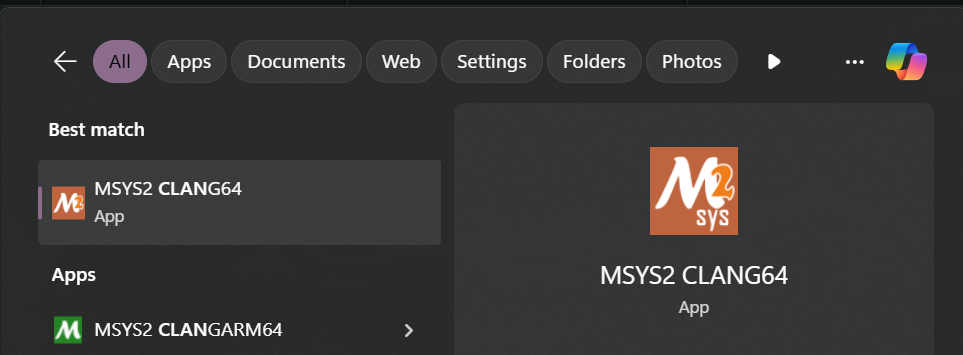
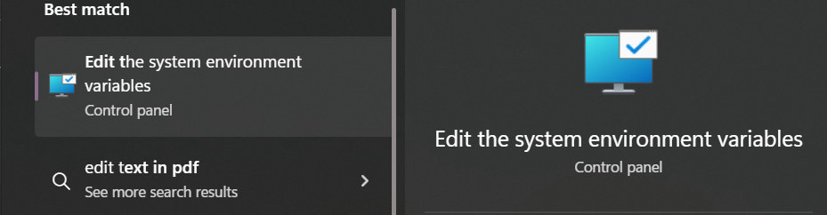
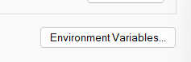
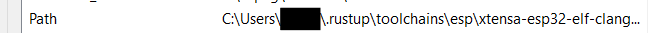

# x86_64-pc-windows-gnullvm

Once you have installed rustup following the steps in the Toolchain Setup chapter, we will install CLANG for CLANG64 and then we can start using rust to compile our projects.

## Installing CLANG:

- Open CLANG64 terminal of MSYS2, by typing in `MSYS2 CLANG64` in the search bar and opening the terminal. 

- Type in the following command to install GCC: `pacman -S mingw-w64-clang-x86_64-clang` and click enter.

- It might confirm installation with you, type in `Y` and press enter to continue.

- Once installed, close the terminal and then go to search on taskbar again and search for `Edit the System Environment Variables`. Open it and go to Enviroment Variables.  

- Then go to path variable and add the clang installation path to it, in my case it is `C:\msys64\clang64\bin` as I chose the default installation location for MSYS2.  

- Close the windows, open terminal and type in `clang --version`, if it returns the version of CLANG, then the installation was successfull. If not then go through the above procedure again.

## Adding x86_64-pc-windows-gnullvm target to rustup:

We will need the rust compiler to use and link to the llvm tools and C compiler, and for that we will need to use `x86_64-pc-windows-gnullvm` as the compilation target.

- Open file explorer, go to user path i.e. `C:\Users\user` ( here, user is the name of your local/online account ).

- Open `.cargo` folder. Create a new text document there called `config.txt` and rename it to `config.toml`. Open this document using VSCode or any other editor of your choice.

- Paste the following content in the config file:
  ```toml
  [build]
  target = "x86_64-pc-windows-gnullvm"
  ```

- Open terminal and type in the following command: `rustup target add x86_64-pc-windows-gnullvm`, click enter and wait for rustup to install this target. Once done you are ready to compile any rust code.

The installation is now complete. You can now test rust by creating a new hello world project using `cargo init hello_world`, change directory to `hello_world` and run `cargo run`. If you see `Hello World!` printed in your console then the setup of rust was successfull.